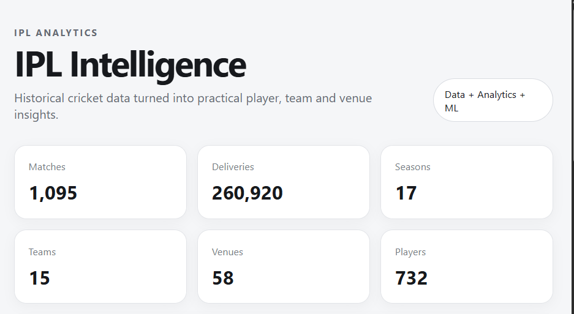
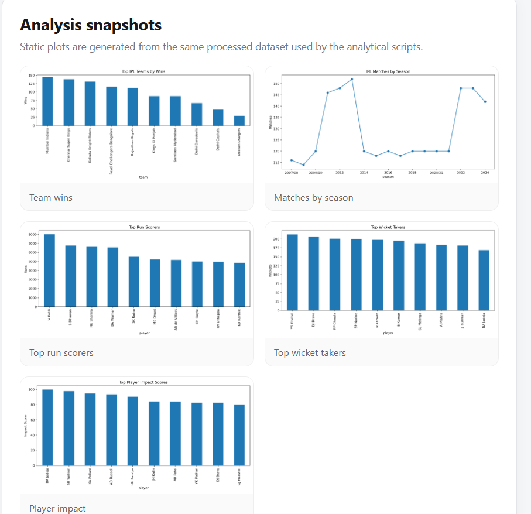
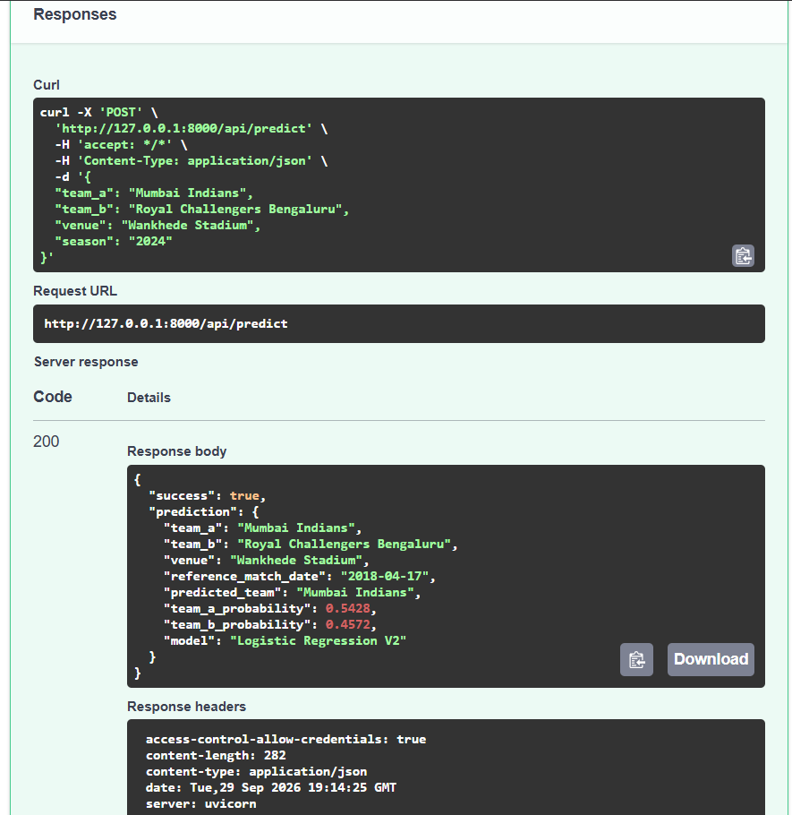

# IPL Intelligence & Tactical Analytics Platform

A practical IPL analytics project built around historical match and ball-by-ball data. The project started as a small Python analysis and was expanded into a data pipeline, analytical layer, machine-learning service, PostgreSQL-ready backend and React dashboard.

The main idea is simple: instead of only showing cricket scores, the project uses historical data to answer questions such as **what happened, how players and teams performed, how matchups behaved, what venues looked like historically, and what a model estimates for a future matchup**.

## What the project covers

### Data pipeline
- Raw CSV ingestion
- Column and schema checks
- Missing-value handling
- Numeric conversion
- Date parsing
- Basic entity cleanup
- Enriched delivery dataset
- Reproducible feature-building scripts

### Player analytics
Batting analysis includes:
- Runs
- Balls faced
- Batting average
- Strike rate
- Fours and sixes
- Boundary-run percentage
- Dot-ball percentage
- Matches played
- Dismissals
- Phase-wise performance

Bowling analysis includes:
- Balls and overs
- Runs conceded
- Wickets
- Economy
- Bowling average
- Bowling strike rate
- Dot balls
- Dot-ball percentage
- Phase-wise performance

### Team intelligence
- Matches
- Wins and losses
- Win percentage
- Season history
- Head-to-head-ready team structure
- Batting output
- Bowling output
- Boundary production
- Dot-ball performance
- Team comparison dashboard

### Matchup analytics
The matchup table supports batsman-vs-bowler analysis using:
- Balls
- Runs
- Strike rate
- Dismissals
- Fours
- Sixes
- Dot balls
- Boundary percentage

It also supports questions such as which bowler has historically limited a batsman and which matchups have produced the most scoring.

### Venue intelligence
Historical venue statistics include:
- Matches
- Average runs per match
- Average first-innings score
- Run rate
- Wickets per match
- Chasing win percentage

The project treats these as **historical venue behavior**, not live pitch information.

### Fielding analytics
The available ball-by-ball fields are used for measurable fielding events such as:
- Catches
- Run-outs
- Stumpings
- Total recorded fielding dismissals
- A simple normalized fielding contribution

Dropped catches, misfields and exact runs saved are **not invented** when the source data does not contain enough information to measure them reliably.

### Player Impact
A composite Player Impact Score combines normalized batting, bowling and available fielding contributions. The score is intended for relative comparison and ranking, not as an official cricket rating.

### Statistical analysis
The project includes a statistics layer for descriptive statistics and hypothesis-testing work. Results are kept separate from causal claims; an observed association should not automatically be interpreted as causation.

### Machine learning
A Logistic Regression V2 model estimates the winner probability from historical pre-match-style features such as:
- Prior team win rate
- Historical venue chasing rate
- Toss information
- Field-first decision

The training script builds team and venue history chronologically to reduce direct use of the current match outcome as a feature.

The model output is an estimate, not a guarantee.

### Explainable AI
The API includes an explanation endpoint using SHAP when available. It shows the contribution of model features for an individual prediction. A model feature-importance fallback is used if the SHAP runtime is unavailable.

### Player recommendations
The recommendation endpoint provides a transparent starting point for ranking players using the Player Impact data and role filters. The design leaves room for richer context-aware ranking using venue, opponent, recent form and matchup data.

## Technology

- Python
- Pandas
- NumPy
- Matplotlib
- SciPy
- Scikit-learn
- XGBoost
- SHAP
- SQL
- PostgreSQL
- SQLAlchemy
- FastAPI
- React
- Vite
- Pytest
- Docker
- GitHub Actions

## Repository structure

```text
IPL_Intelligence_Tactical_Analytics_Platform/
├── backend/
│   └── app/
├── data/
│   ├── raw/
│   └── processed/
├── frontend/
│   └── src/
├── models/
├── output/
│   └── graphs/
├── scripts/
├── sql/
├── src/
├── tests/
├── docker-compose.yml
├── requirements.txt
└── README.md
```

## Generated analysis

The repository includes processed analytical tables and example graphs generated from the supplied IPL dataset.

Graphs include:
- Team wins
- Matches by season
- Top run scorers
- Top wicket takers
- Player impact ranking

Processed tables include:
- `batting_stats.csv`
- `bowling_stats.csv`
- `batting_phase_stats.csv`
- `bowling_phase_stats.csv`
- `matchup_stats.csv`
- `venue_stats.csv`
- `fielding_stats.csv`
- `player_impact.csv`
- `team_stats.csv`
- `team_season_stats.csv`

## Running the Python analysis

Create a virtual environment and install dependencies:

```bash
python -m venv .venv

# Windows
.venv\\Scripts\\activate

# macOS/Linux
source .venv/bin/activate

pip install -r requirements.txt
```

Validate the raw files:

```bash
python scripts/validate_data.py
```

Rebuild the analytical tables:

```bash
python -m src.analytics
```

Run the statistical analysis:

```bash
python src/statistics.py
```

Train the match model:

```bash
python scripts/train_match_model.py
```

## Running the API

From the repository root:

```bash
uvicorn backend.app.main:app --reload
```

The API will be available at `http://localhost:8000` and interactive API documentation is available at `/docs`.

## Running the React dashboard

```bash
cd frontend
npm install
npm run dev
```

The Vite development server will normally be available at `http://localhost:5173`.

If the API is running on another address, set `VITE_API_BASE_URL` before starting the frontend.

## PostgreSQL

The project includes a PostgreSQL schema in `sql/schema.sql` and a seed script in `scripts/seed_database.py`.

Set `DATABASE_URL` in `.env` and run:

```bash
python scripts/seed_database.py
```

The React dashboard currently reads the processed analytical data through FastAPI. PostgreSQL is included as the structured persistence layer for extending the application into a database-first deployment.

## Docker

The repository includes a Docker Compose setup for PostgreSQL, FastAPI and the React development server:

```bash
docker compose up --build
```

## API examples

```text
GET  /api/summary
GET  /api/teams
GET  /api/teams/{team}
GET  /api/teams/compare/{team_a}/{team_b}
GET  /api/players
GET  /api/players/{player}
GET  /api/matchups/{batter}/{bowler}
GET  /api/venues
GET  /api/venues/{venue}
GET  /api/team-analytics
GET  /api/player-recommendations
POST /api/predict
POST /api/explain
GET  /api/model/metrics
```

## Data notes

The analysis is based on the supplied IPL match and delivery datasets. Historical data has limitations: player/team names can change over seasons, some event-level fielding information is incomplete, and older matches may not contain the same level of detail as newer matches.

For that reason, metrics are only calculated where the underlying fields support them, and derived scores are presented as project metrics rather than official cricket statistics.

## Future improvements

The current application can be extended with:

- Recent-form feature engineering
- More robust time-based model validation
- XGBoost model comparison
- Calibrated prediction probabilities
- Richer SHAP visualizations
- Context-aware recommendation ranking
- User authentication and saved analyses
- Redis caching
- Background data-processing jobs
- More comprehensive automated tests
- Production deployment
- Model experiment tracking with MLflow
- Improved responsive dashboards and richer visual exploration

## Dashboard Preview

### Main Dashboard


### Analysis Snapshots


### ML Match Prediction


## Author

Trinadh Reddy
